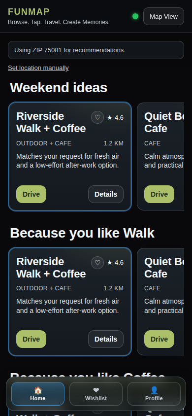
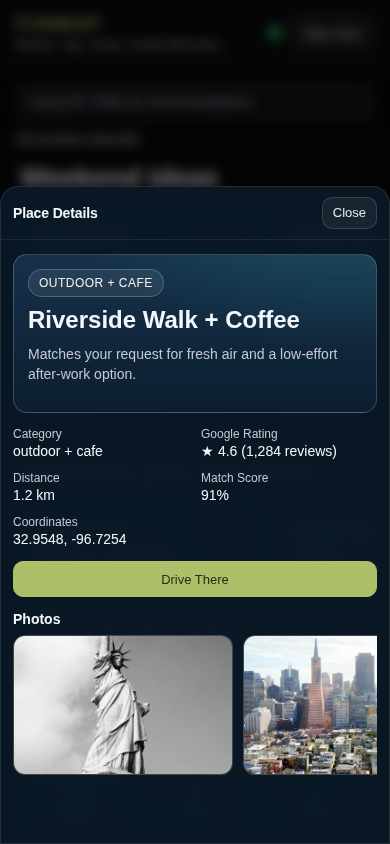
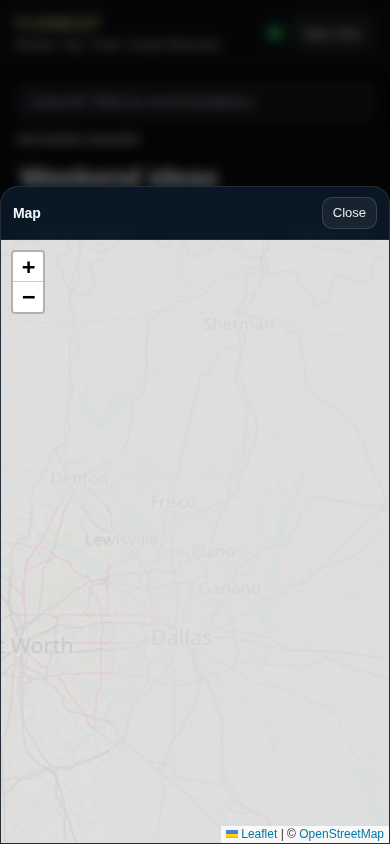
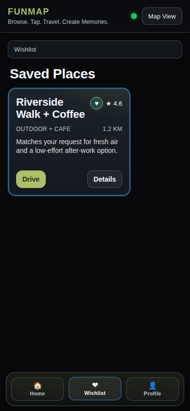
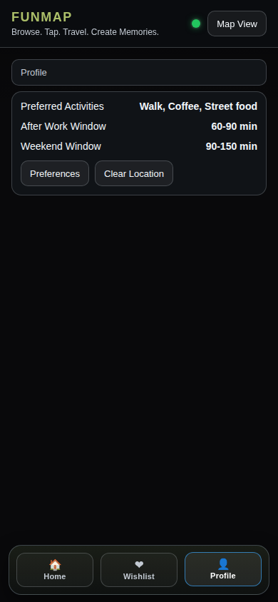

# funmap

<p align="center">
  <b>Discover places worth leaving home for.</b><br/>
  Scroll, save, and go.
</p>

<p align="center">
  <a href="#quick-start">Quick Start</a> •
  <a href="#features">Features</a> •
  <a href="#screenshots">Screenshots</a> •
  <a href="#tech-stack">Tech Stack</a> •
  <a href="#roadmap">Roadmap</a>
</p>

<p align="center">
  
  
  
  
</p>

---

## Why funmap

Most maps products are search-first.  
**funmap is browse-first**: it gives you a taste-aware feed, lets you wishlist what you like, and moves you to navigation fast.

---

## Features

- Mobile-first recommendation feed with horizontal place rails
- GPS-first location, with ZIP fallback if permission is denied
- Place details sheet with richer metadata and photos
- One-tap drive handoff to Google Maps
- Wishlist flow directly from place cards
- Profile/preferences flow for personalization

---

## Screenshots

<p align="center">
  <b>1) Discover on Home</b> &nbsp;&nbsp;→&nbsp;&nbsp;
  <b>2) Inspect Place Details</b> &nbsp;&nbsp;→&nbsp;&nbsp;
  <b>3) Open Map View</b>
</p>

<p align="center">
  
  
  
</p>

<p align="center">
  <b>4) Save in Wishlist</b> &nbsp;&nbsp;→&nbsp;&nbsp;
  <b>5) Review Profile Preferences</b>
</p>

<p align="center">
  
  
</p>

<p align="center"><i>User journey: Discover → Inspect → Navigate → Save → Personalize</i></p>

---

## Project Structure

```text
funmap/
├── backend/   # Node.js + Express API
├── frontend/  # React + Vite app (mobile-first UI)
├── docs/      # Architecture + screenshots
└── scripts/   # Utility scripts (screenshot capture, etc.)
```

---

## Quick Start

### Prerequisites

- Node.js 22+ (see `.nvmrc`)
- npm
- Git

### Development platform notes (for contributors)

- **macOS / Linux:** run directly in your terminal.
- **Windows:** both are supported:
  - PowerShell / Command Prompt (native Windows Node)
  - WSL2 (recommended for smoother native-dependency behavior)
- Pick **one environment per clone**. Avoid switching the same working copy between Windows Node and WSL Node.

These notes are only about where developers run the code.  
The product experience itself is mobile-first.

### 1) Clone

```bash
git clone https://github.com/K-bhuvan/funmap.git
cd funmap
```

### 2) Run backend

```bash
cd backend
npm install
npm run dev
```

Backend: `http://localhost:8080`

### 3) Run frontend (new terminal)

```bash
cd frontend
npm install
npm run dev
```

Frontend: `http://localhost:3000`

Vite proxies `/health` and `/v1` to backend `:8080`.

### Run on a phone (mobile web)

From `frontend/`:

```bash
npm run dev -- --host
```

Then open the printed network URL (`http://<your-lan-ip>:3000`) on your phone (same Wi-Fi).

### Optional (Windows + WSL only)

If native dependencies ever break (Rollup/esbuild), run:

```bash
./scripts/wsl-bootstrap.sh
```

Reference setup guide: [docs/WSL.md](./docs/WSL.md)

---

## Tech Stack

- **Frontend:** React 18, TypeScript, Vite
- **Mapping UI:** Leaflet + react-leaflet
- **Backend:** Node.js, Express, TypeScript
- **Current data mode:** mock recommendations + ZIP/GPS context

---

## Current Status

- ✅ Core UX flow is functional
- ✅ Mobile aspect-ratio shell + bottom nav
- ✅ Wishlist interactions and details panel
- 🚧 Live Places/Routes provider integration (Google Maps) in progress
- 🚧 Backend profile persistence (currently local storage on web)

---

## Roadmap

- [ ] Google Places + Routes integration
- [ ] Persistent profile/persona in backend
- [ ] Better candidate diversity + ranking strategy
- [ ] Native Android/iOS clients
- [ ] Shareable trip cards + social loops

---

## Refresh Screenshots

```bash
node scripts/capture-screenshots.js
```

---

## Disclaimers & acknowledgements

- **Prototype quality:** The current product surface is a web MVP for fast iteration on UX and API shape.
- **Mock data:** Recommendations are currently generated from a curated mock dataset. A real ML/LLM-powered recommendation engine is on the roadmap.
- **Geocoding:** ZIP fallback currently uses `zippopotam.us` for postal code to lat/lng lookup.
- **Maps handoff:** The current implementation opens Google Maps directions URLs. This project is not affiliated with, endorsed by, or sponsored by Google.
- **Map tiles:** Map tiles in the web prototype are © [OpenStreetMap contributors](https://www.openstreetmap.org/copyright), licensed under [ODbL](https://opendatacommons.org/licenses/odbl/).
- **No warranty:** This project is provided as-is for personal and educational use. Use in production is at your own risk.

---

## Contributing

This is a personal MVP project. Issues and pull requests are welcome, but please open an issue first to discuss significant changes.

---

## License

MIT (when `LICENSE` is added to repo root).
